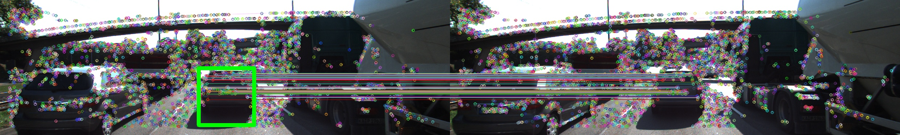

# SFND 3D Object Tracking

This work presents the algorithm and results obtained with the second project proposed by Udacity Sensor Fusion Engineer Nanodegree program. The main task of this project is 3D bounding boxes tracking and both camera and lidar based TTC (Time To Colision) estimation. The video below shows the results with the final algorithm implemented.

## Algorithm

**Step 1 - Detect and classify objects**

For each image detect all objects and find their corresponding bounding boxes with [YOLO](https://arxiv.org/pdf/1506.02640v5.pdf).

**Step 2 - Keypoints extraction and matching**

Selecting a keypoint extractor and a matching method, find the corresponding keypoints of the current image with the previous one. 

**Step 3 - Match 3D Objects between current frame and previous frame** 

(Implemented code: [matchBoundingBoxes function](src/camFusion_Student.cpp))

To accomplish this task, get all possible bounding box pairs (one from current image and the other from the
previous image) and the respective number of matched keypoints inside both bounding boxes for each
pair. Then, sort all the pairs by the counted number of keypoints matches. Finally, insert the pairs with
highest number of keypoint matches to an array (bbBestMatches) without repeating already used bounding boxes
along the choosed pairs. An extra step is done, where keypoints from matches that are out of the current
or previous image bounding boxes are deleted from "matches" vector.

**Step 4 - Compute Lidar-based TTC**

(Implemented code: [computeTTCLidar function](src/camFusion_Student.cpp))

Before compute the Lidar-based TTC, the Lidar points are filtered in filterLidarOutliers function. This
function filters Lidar points with distance in x axis near to the median value (median-threshold <=
filtered <= median+threshold). Then, the closest distance in the filtered Lidar points is found both in
previous frame and the current frame, so the TCC is calculated.

**Step 5 - Associate Keypoint Correspondences with Bounding Boxes**

(Implemented code: [clusterKptMatchesWithROI function](src/camFusion_Student.cpp))

For each keypoint match inside the current bounding box (current bounding box is slightly
shrinked to avoid having too many outlier points around the edges), insert the keypoint into empty
vector and the match into a second empty vector, also compute the distance between matched keypoints
position and insert this distance into a third empty vector (named distance vector). In distance vector, the
mean and standart deviation values are found for Z score computation. Zscore is found for each
distance in the distance vector, the keypoints and matches with the respective distance Zscore less than
a threshold value (1.0) are filtered. Finally, the keypoints inside the vector are associated to the
respective Bouding Box.

**Step 6 - Compute Camera-based TTC**

(Implemented code: [computeTTCCamera function](src/camFusion_Student.cpp))

Distance ratios between all matched keypoints are computed and stored in a vector. If this vector is not
empty, the median value is found and used for TTC camera-based calculation. The median value is
used to avoid outliers.

## Performance Evaluation

The results on which is discussed the performance of different combinations of keypoint extractors with keypoint matching methods for TCC estimation is shown in this [file](media/tables.pdf).

### Performance Evaluation 1

Comparing the estimated Lidar-based TTC values with the manually calculated ones based on the top
view perpective, it gives an impression that some Lidar-based TTC estimations are way off (Frame 4, 7
and 10 from TCC LIDAR table). These wrong TTC values estimation are probably due to the filtering
step, where some Lidar points are erroneously deleted from the point cloud, leading to a TTC
miscalculation (distances are not the true minimum values in one or both current and previous frames).
The top view image of each given example are shown in the figures bellow, where the current frame is
in the right side and the previous frame in the left.

### Performance Evaluation 2

Looking at the camera-based TTC estimations, many nan values are found, where the major use
HARRIS or ORB detector. This happend lijely because of small number of keypoint detected along the
frames. High or too low TTC camera based estimations appear among the results, such values are
exemplified in frame 7 from ORB/FREAK set and frame 6 from HARRIS descriptor sets. It is probably
because of mismatching keypoints, leading to wrong h ratio (h_1 / h_0) calculation and then wrong
TTC estimation. According to MAE (Mean of Absolut Error) metric, where manually TTC estimated
values were considered as the reference TTC values for each frame, FAST/FREAK set showed the best
performance.

## Source code structure

[./src/FinalProject_Camera.cpp](https://github.com/Marconefs/SFND_3D_Object_Tracking/src/FinalProject_Camera.cpp) - Main function

[./src/dataStructures.h](https://github.com/Marconefs/SFND_3D_Object_Tracking/src/dataStructures.h) - Data structure used in this project

[./src/camFusion_Student.cpp&hpp](https://github.com/Marconefs/SFND_3D_Object_Tracking/src/camFusion_Student.cpp) - Implemented functions

[./src/lidarData.cpp&hpp](https://github.com/Marconefs/SFND_3D_Object_Tracking/src/lidarData.cpp) - Some utilities

[./src/matching2D.cpp&hpp](https://github.com/Marconefs/SFND_3D_Object_Tracking/src/matching2D.cpp) - Functions with different methods for keypoint maching task

[./src/objectDetection2D.cpp&hpp](https://github.com/Marconefs/SFND_3D_Object_Tracking/src/objectDetection2D.cpp) - Class for object detection task

## Dependencies for Running Locally
* cmake >= 2.8
  * All OSes: [click here for installation instructions](https://cmake.org/install/)
* make >= 4.1 (Linux, Mac), 3.81 (Windows)
  * Linux: make is installed by default on most Linux distros
  * Mac: [install Xcode command line tools to get make](https://developer.apple.com/xcode/features/)
  * Windows: [Click here for installation instructions](http://gnuwin32.sourceforge.net/packages/make.htm)
* Git LFS
  * Weight files are handled using [LFS](https://git-lfs.github.com/)
* OpenCV >= 4.1
  * This must be compiled from source using the `-D OPENCV_ENABLE_NONFREE=ON` cmake flag for testing the SIFT and SURF detectors.
  * The OpenCV 4.1.0 source code can be found [here](https://github.com/opencv/opencv/tree/4.1.0)
* gcc/g++ >= 5.4
  * Linux: gcc / g++ is installed by default on most Linux distros
  * Mac: same deal as make - [install Xcode command line tools](https://developer.apple.com/xcode/features/)
  * Windows: recommend using [MinGW](http://www.mingw.org/)

## Basic Build Instructions

1. Clone this repo.
2. Make a build directory in the top level project directory: `mkdir build && cd build`
3. Compile: `cmake .. && make`
4. Run it: `./3D_object_tracking`.
